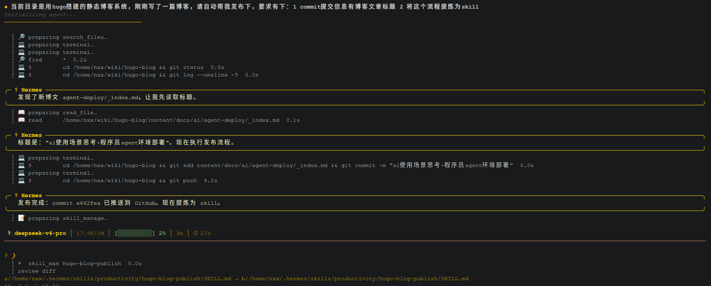
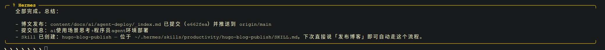

## 探索场景

自己对ai的使用还处于探索阶段，可能用ai增效的场景：
1. 本职工作提效，程序员当然就是用ai写设计写代码，这也是当前最成熟的领域。为什么这个领域最先发力，可以搜下“张小珺商业访谈录 姚顺宇4小时访谈”，核心大概可以总结为个ithub天然专家数据库+结果可测试可量化。
2. 日常场景提效，比如查资料论文（炒菜、旅游计划等），博客主同步在几个平台发表博客，各类数据汇总（账单、股票、咨询行情等）和通知（邮件、微信等等）。
3. Good idea！这个单独拎出来，应为感觉价值最大。当前很多博主讲的都是伪需求，或者说教学demo。一个想法的商业价值和有没有ai没有本质联系，我觉得ai在这方法有帮助的地方在于：
   1. 记录灵感+养成多问一句多想一层的习惯（手机装好app，准备随时发问，过段时间看看最近都问了什么，也可以整理下）。
   2. 深度持续对话自己，哲学或精神层面剖析自我。
   3. 快速验证，小步快跑，降低成本，即一人公司。

## 进一步思考

通过上面的总结，看起来ai是工具。执行力强，思考力强，自制力强的human那个阶段都在升级打怪。上面提到的伪需要好像也是很有意思的，带动了周边能力（强制使用ai，强制思考内容输出比如写这篇博客时的我）。

上面的使用场景中，有一个与现有自我知识体系的融合与冲突。比如，当我用ai持续对话时，是基于已有的认知和知识库，有可能由于在某个方面积累较深问的问题是很有质量的，也可能已有的认知和知识库阻碍了我发散性思维。

## agent搭建

本地模型太弱了，个人电脑一般不可能跑过厂商的服务器的，刚开始有段时间导致用本地模型时虽然获得了一些快感，马上发现好鸡肋质量差浪费时间，还是要打开ai厂商app。

目前个人ai使用场景是这样的：
- 编程用codex，探索生活场景提效用hermes agent，其他想到什么用手机deepseek app。
- codex、hermes agent通过CC Switch连接deepseek厂商模型api服务。

下面部署大多在用户级别部署的，个别为了省事用了系统工具部署，核心是为了不影响系统软件（比如避免python node冲突）。
安装后在当前shell一般要运行source ~/.bashrc或重新打开shell生效。

安装uv，管理Python、虚拟环境、依赖等
```bash
curl -LsSf https://astral.sh/uv/install.sh | sh
uv --version
# uv 0.11.17 (x86_64-unknown-linux-gnu)
uv python list
# cpython-3.15.0b1-linux-x86_64-gnu                 .local/share/uv/python/cpython-3.15-linux-x86_64-gnu/bin/python3.15
# cpython-3.15.0b1-linux-x86_64-gnu                 .local/share/uv/python/cpython-3.15-linux-x86_64-gnu/bin/python3 -> python3.15
# cpython-3.15.0b1-linux-x86_64-gnu                 .local/share/uv/python/cpython-3.15-linux-x86_64-gnu/bin/python -> python3.15
# cpython-3.15.0b1-linux-x86_64-gnu                 .local/bin/python3.15 -> .local/share/uv/python/cpython-3.15.0b1-linux-x86_64-gnu/bin/python3.15
# cpython-3.15.0b1-linux-x86_64-gnu                 <download available>
# cpython-3.15.0b1+freethreaded-linux-x86_64-gnu    <download available>
# cpython-3.14.5-linux-x86_64-gnu                   <download available>
# cpython-3.14.5+freethreaded-linux-x86_64-gnu      <download available>
# cpython-3.14.4-linux-x86_64-gnu                   /usr/bin/python3.14
# cpython-3.14.4-linux-x86_64-gnu                   /usr/bin/python3 -> python3.14
# 说明/usr/bin/python3.14系统自带，.local/bin/python3.15使用uv python install 3.15安装，后面hermes使用本地python3.15，当冲突时再在本地换到相应版本
```

安装nvm，管理node、npm等
```bash
curl -o- https://raw.githubusercontent.com/nvm-sh/nvm/master/install.sh | bash
nvm --version
# 0.40.4
nvm list
# ->     v24.15.0
# default -> lts/* (-> v24.15.0 *)
# iojs -> N/A (default)
# node -> stable (-> v24.15.0 *) (default)
# stable -> 24.15 (-> v24.15.0 *) (default)
# unstable -> N/A (default)
# lts/* -> lts/krypton (-> v24.15.0 *)
# lts/argon -> v4.9.1 (-> N/A)
# lts/boron -> v6.17.1 (-> N/A)
# lts/carbon -> v8.17.0 (-> N/A)
# lts/dubnium -> v10.24.1 (-> N/A)
# lts/erbium -> v12.22.12 (-> N/A)
# lts/fermium -> v14.21.3 (-> N/A)
# lts/gallium -> v16.20.2 (-> N/A)
# lts/hydrogen -> v18.20.8 (-> N/A)
# lts/iron -> v20.20.2 (-> N/A)
# lts/jod -> v22.22.2 (-> N/A)
# lts/krypton -> v24.15.0 *
# 说明v24.15.0使用nvm install --lts安装，并用nvm use 24.15.0设为本地全局默认版本，后面hermes使用本地node v24.15.0，当冲突时再在本地换到相应版本
```

安装codex
```bash
npm i -g @openai/codex@latest
```

安装hermes agent
```bash
# 克隆Hermes
git clone --recurse-submodules https://github.com/NousResearch/hermes-agent.git .hermes-agent
cd .hermes-agent
git submodule update --init --recursive
# 创建虚拟环境
uv venv .venv --python 3.15
# 安装Python依赖
uv pip install -e ".[all]"
# 安装Node依赖
npm install
# 创建软链接
ln -sf "$(pwd)/.venv/bin/hermes" ~/.local/bin/hermes
```

安装CC Switch
```bash
# 下载CC-Switch-v3.16.0-Linux-x86_64.deb
sudo apt install ./CC-Switch-v3.16.0-Linux-x86_64.deb
```

购买deepseek模型，网站上申请api key填入CC Switch

## 提炼第一个skill工作流





经过几轮对话，hermes已经可以把写好的一篇博客提交到git静态博客，且同步到微信公众号。

遗留问题，只能保存到草稿箱，原创和分类还有手动运行，不过这不是能力问题，主要在于个人公众未认证待完善。

本次花费token人民币不到1.5元，已提炼skill，后续同样任务不再消耗金额，一次性成本。
